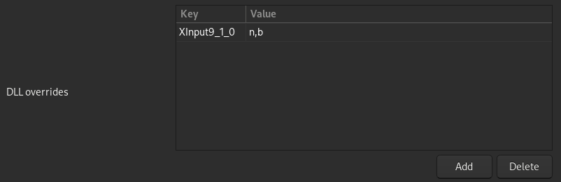

# How to get your favorite™ Geometry Dash modding sdk; Geode, on Linux!
Geode SDK is yadayada you know the gist, heres the actual guide:
<br /><br />

## 1. Getting the files
Download the latest release for Windows [here](https://github.com/geode-sdk/geode/releases/latest).  
Make sure its the .zip file

## 2. Extracting the files
Extract everything to your Geometry Dash folder, most likely in the `.steam/steam/SteamApps/common` or `~/.var/app/com.valvesoftware.Steam/data/Steam/steamapps/common` (Flatpak) folder.

## 3. DLL Overrides
**If you use Proton (Steam):**
Paste this into your Launch Options
```
WINEDLLOVERRIDES="XInput9_1_0.dll=n,b" %command%
```
<br />

**If you use Lutris:**
Configure your DLL overrides to look like this  

<br /><br /><br />

`- - - - - - - - - - - - SRC - - - - - - - - - - - -`  
`https://github.com/geode-sdk/geode/issues/155`  
`https://github.com/geode-sdk/geode/discussions/190`  
`- - - - - - - - - - - - END - - - - - - - - - - - -`